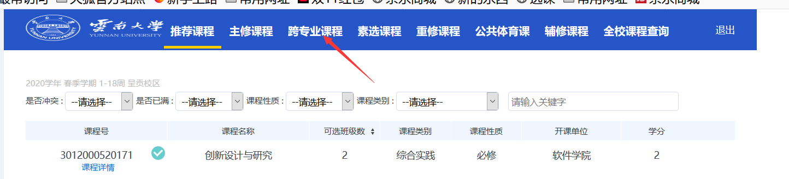
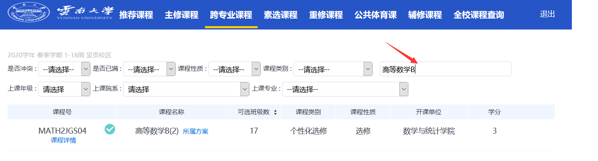
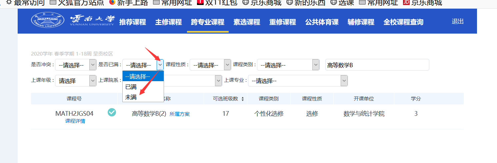
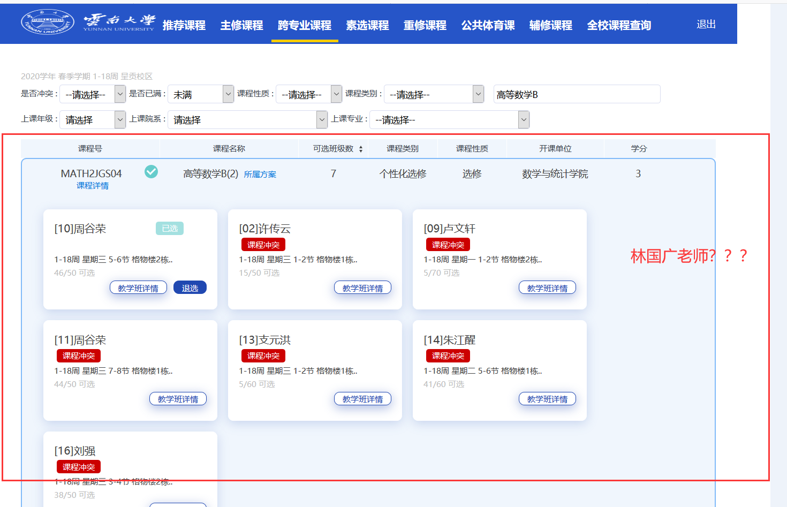

## BGk“庆寒假，迎新春——渤哥寒假抽奖式选课活动”方案策划

### 一、活动目的

​	为相应国家对新时代下完善高等教育教学模式的号召，努力完成高等教育在新时代承担的新使命，提升高等教育适应新时代、迎接新时代、领跑新时代的能力【1】，进一步丰富BGk全体成员的寒假生活提升寒假空余时间的处理质量，保证成员在寒假期间能够充分有效地利用空余时间完成学业和娱乐的双重突破，BGk活动策划中心、BGk对外交流活动组织委员会联合BGk学习革命委员会，共同策划了此次活动。

### 二、活动内容

本次迎新春活动主包括如下内容与流程：

活动时间：**2020年1月17日-2020年2月24日**

1. 接收BGk成员BGkLemon提供的选课用户名和密码

2. 使用BGk成员BGkLemon提供的选课网址、选课方式、选课要求等（详见后续细则）进行操作
3. 评定活动成果
4. 颁奖
5. 寄送礼品
6. 发表证书

**细则**

选课网址：<http://xk.ynu.edu.cn/xsxkapp/sys/xsxkapp/*default/index.do>

用户名和密码：活动参与者在报名后通过向BGkLemon索取

选课方式：

1. 登录系统

2. 进入到跨专业选课模块

   

3. 在搜索框内输入“高等数学B”并回车

   

4. 在是否已满下拉菜单中选择“未满”

   

5. 然后点开，查看是否有**林国广**老师的**高等数学B**课程名额：

   

6. 如果有**林国广**老师的课程则立即向BGkLemon拨打电话：15708749187，或者通过其余有效方式进行联系。

7. BGkLemon立即登入选课系统进行后续操作。如果BGkLemon能顺利选上林国广老师的高数课，则活动圆满完成！

### 三、奖励方式

​	本次活动的奖励凭证的生成方式使用模糊计分制，依照活动参与人员在活动期间的活跃度计分包括登录截图、查看情况截图等。

​	活动期间BGk习革命委员会将会对活动参与人员进行不定时不定额派发红包奖励！

### 四、注意事项

1. 活动进行期间，不需要对已选课程的任何操作。
2. 本次活动由BGk学习革命委员会保留最终解释权。

【参考】

【1】https://www.chsi.com.cn/jyzx/201712/20171220/1644902651.html 学信网：新时代高等教育面临新形势